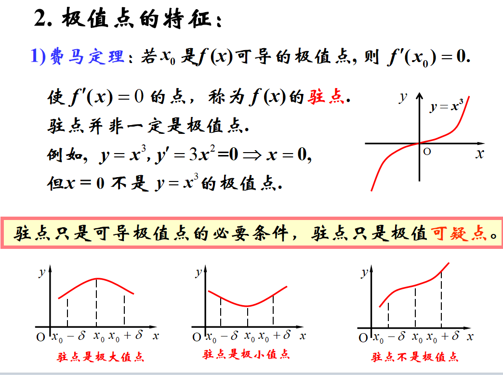
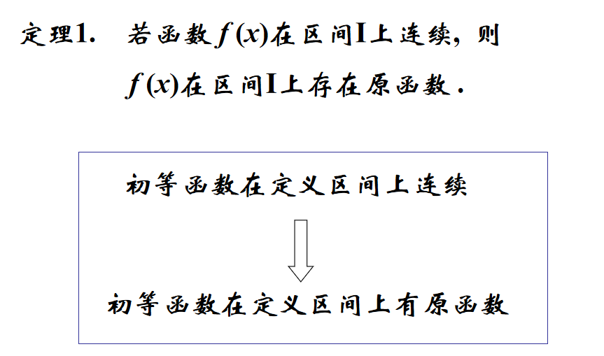
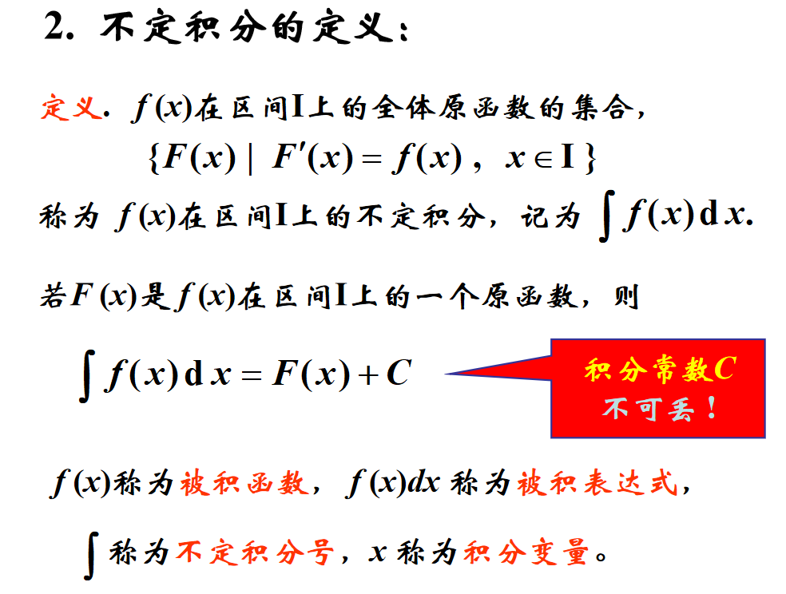
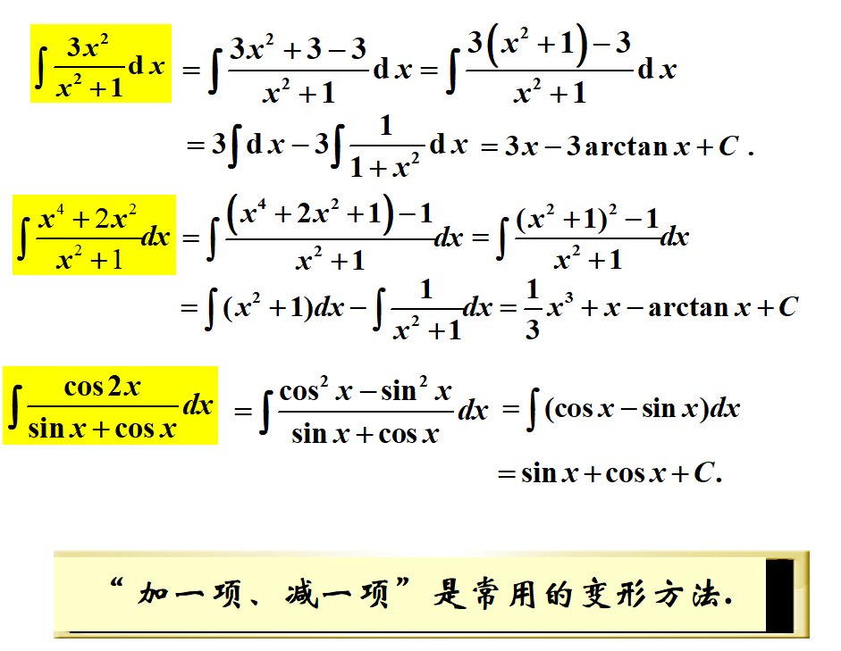
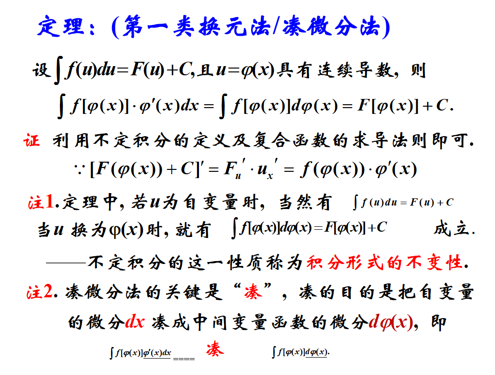
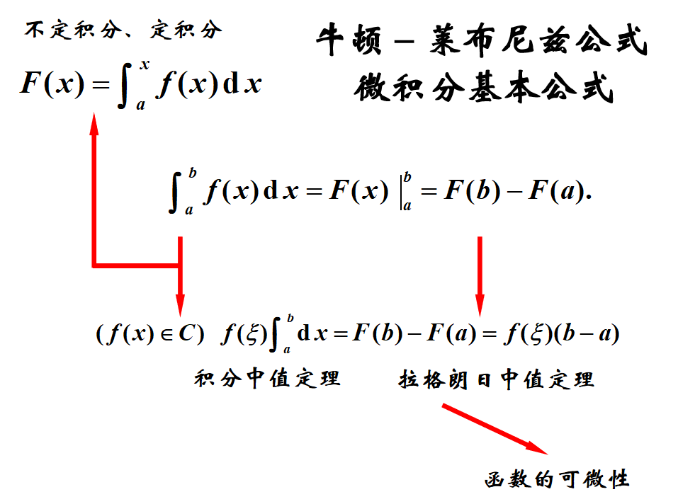
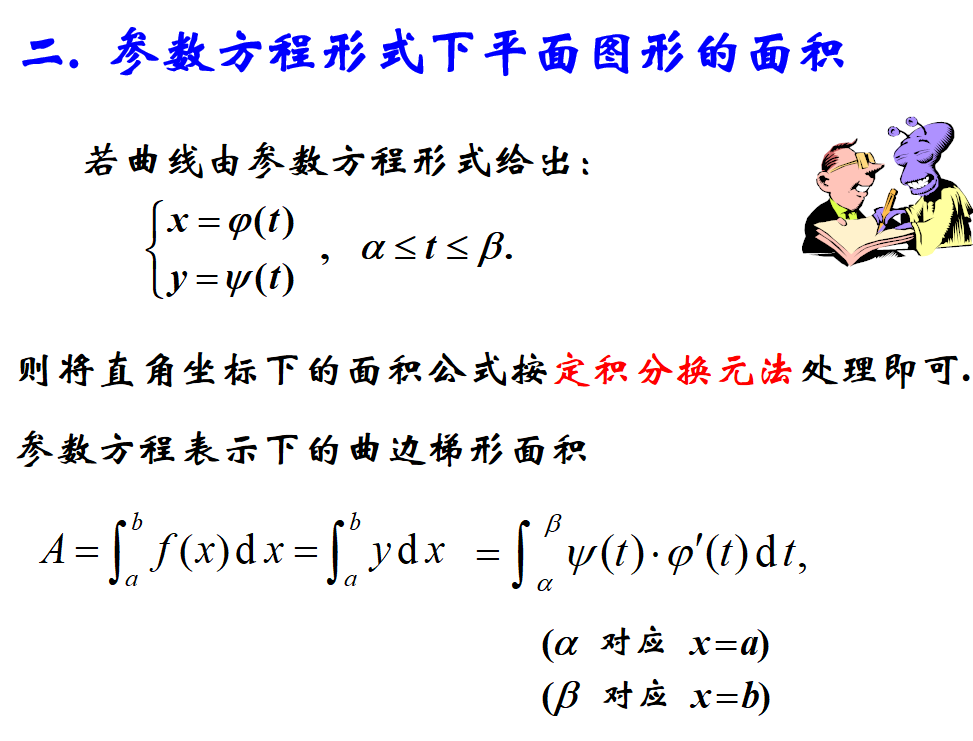
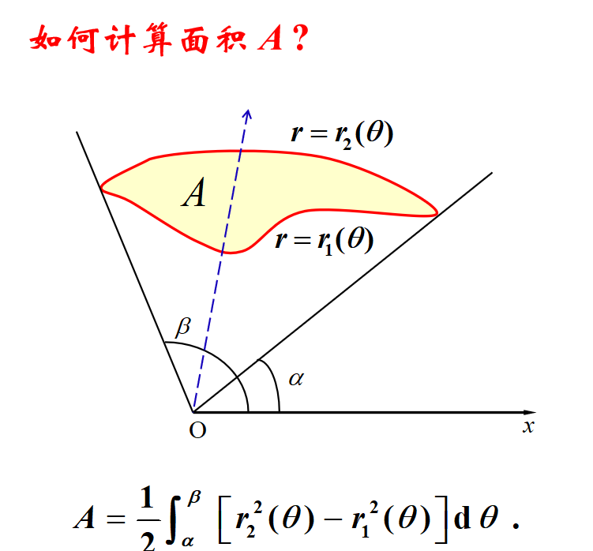

挑战两周复习完同济高数上册。只复习我认为的重点。前面不会怎么看的。
<!--more-->
# 一、函数与极限
## 函数
### 性质
- 有界性
- 单调性
- 奇偶性
- 周期性

### 反函数与复合函数
### 基本初等函数
- 幂函数 $y=x^μ$
- 指数函数 $y=a^x$
- 对数函数 $y=\log_\alpha X$
- 三角函数 $y=\sin\theta$
- 反三角函数 $y=\arcsin\theta$

### 双曲函数
P13
## 数列的极限
定义：设{$x_n$}为一数列，如果存在常数$a$，对于任意给定的正数$\varepsilon$(不论它多么小)，总存在正整数$N$，使得$n>N$时，不等式$\mid x_n-a\mid <\varepsilon$都成立，那么就称常数$a$是数列{$x_n$}的极限，或者称数列{$x_n$}收敛与$a$，记为$\lim_{n\to\infty}x_n=a$或$x_n\rightarrow a (n\rightarrow\infty)$.

### 收敛数列的性质
- (极限的唯一性) 如果数列{$x_n$}收敛，那么它的极限唯一
- (收敛数列的有界性) 如果数列{$x_n$}收敛，那么数列{$x_n$}一定有界
- (收敛数列的保号性) 如果$\lim_{n\to\infty}x_n=a$，且$a>0或a<0$，那么存在正整数$N$，当$n>N$时，都有$x_n>0或x_n<0$
- >推论：如果数列{$x_n$}从某项起有$x_n\geq0或x_n\leq0$，且$\lim_{n\to\infty}x_n=a$，那么$a\geq0或a\leq0$
- (收敛数列与其子数列间的关系)如果数列{$x_n$}收敛与a，那么它的任一子数列也收敛于a

## 函数的极限
### 性质
见P32
### 无穷小与无穷大
见P34
### 极限运算法则
见P38
### 两个重要极限
1. $$\lim_{x\to0}\frac{\sin x}{x}=1$$
2. $$\lim_{x\to\infty}(1+\frac{1}{x})^x=e$$
3. $$\lim_{z\to0}(1+z)^{\frac{1}{z}}=e$$

### 无穷小的比较
P52
### 等价无穷小

### 函数的连续性与间断点

## 导数与微分
### 导数的求导法则
### 反函数的导数是原函数导数的倒数
### 复合函数求导，链式法则
### 基本求导公式

### 高阶导数

### 对数求导法
取对数求导法常用来求一些复杂的乘除式、根式、幂指函数等的导数.

### 参数方程求导法

### 求导方法小结

### 微分中值定理
见课件3-1

### 洛必达法则

### 泰勒公式

### 函数的凹凸性
使函数导数为零的点称为函数的驻点.
判断函数单调性的方法
先求出函数一阶导数等于零和一阶导数不存在的点 ,  这些点将定义域分成若干小区间 ,  在每个小区间内考察导数符号，从而确定单调增加还是单调减少区间.

### 弧微分与曲率

## 不定积分

### 凑微分法(第一换元法)

### 第二换元法

### 分部积分法

### 有理函数积分

### 三角有理式的积分

## 定积分
### 定义

### 性质

### 微积分基本定理

### 定积分计算方法
### 凑微分法

### 换元法

### 分部积分法

### 广义积分

### 定积分的应用
### 平面图形的面积

### 旋转体的体积

### 曲线的弧长

### 定积分在物理、经济及其他方面的应用
## 微分方程

